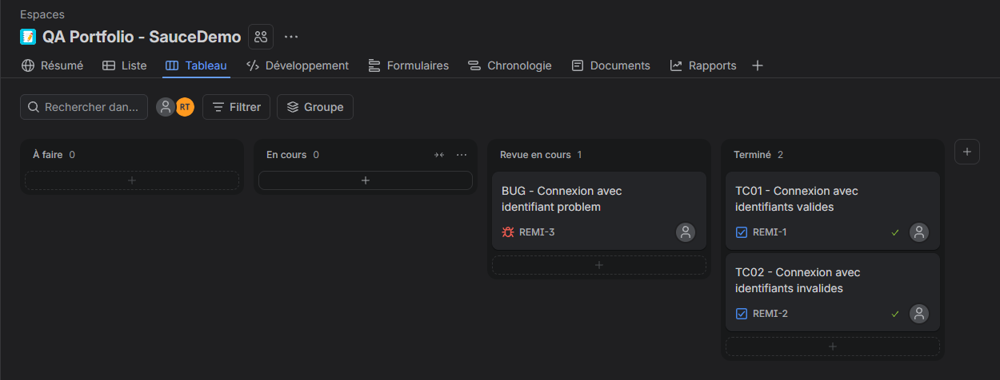
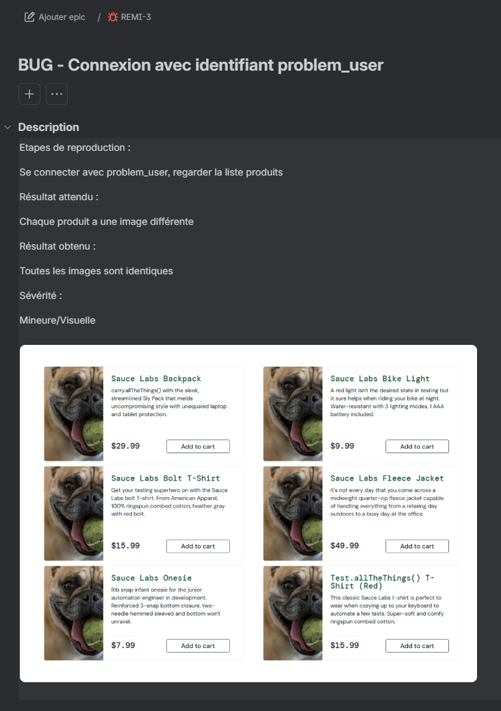

# Automatisation de tests web  SauceDemo

Projet personnel de tests automatisés sur le site de démonstration
saucedemo.com, réalisé dans le cadre d'une reconversion vers le métier
de testeur QA.

## Ce que ce projet démontre
- Automatisation de tests fonctionnels web (Python, Playwright, pytest)
- Cas de test positifs et négatifs (connexion valide/invalide)
- Détection et documentation d'un bug réel (compte `problem_user`)
- Suivi des cas de test et des anomalies dans Jira

## Tests inclus
| TEST--------------------------------- | OBJECTIF----------------------------- | RESULTAT ATTENDU-------------- |
|---------------------------------------|---------------------------------------|--------------------------------|
| test_connexion_reussie--------------- | Connexion avec identifiants valides-- | Page Products affichée-------- |
| test_connexion_mauvais_mot_de_passe-- | Connexion avec mauvais mot de passe-- | Message d'erreur affiché------ |
| test_images_produits_sont_differentes | Détecter le bug des images identiques | XFAIL (bug connu, ticket Jira) |

## Installation et lancement
```
python -m venv venv
venv\Scripts\activate
pip install -r requirements.txt
playwright install
pytest -v
```

## Suivi Jira
Les cas de test et le bug sont documentés dans Jira (captures dans docs).



## Ce que j'ai appris
- Différence entre assertions avec attente automatique (`expect`) et lectures immédiates
- Marquer un bug connu avec `xfail` pour distinguer un échec attendu d'une régression